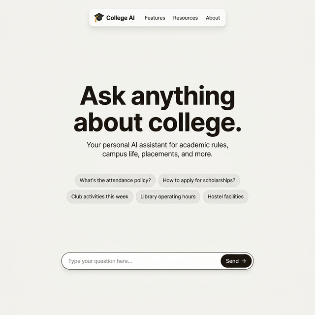
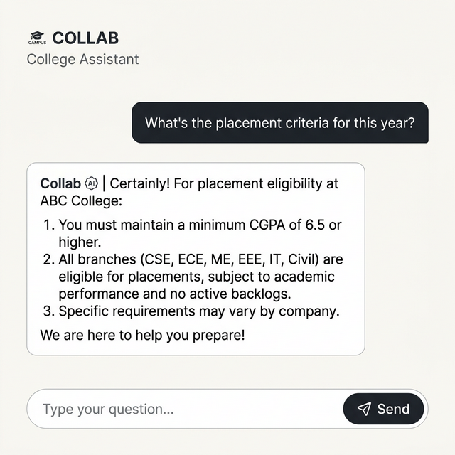

<p align="center">
  <h1 align="center">🎓 College Knowledge Retrieval System</h1>
  <p align="center">
    <strong>An AI-powered chatbot that gives college students instant answers from official documents</strong>
  </p>
  <p align="center">
    Built with LLM + RAG (Retrieval-Augmented Generation) · Ollama · ChromaDB · React · FastAPI
  </p>
</p>

---

<p align="center">
  
  &nbsp;&nbsp;&nbsp;
  
</p>

## 🧐 Why This Project?

College students often struggle to find specific information buried in lengthy policy documents, rulebooks, and scattered PDF files. Questions like:

- *"What's the minimum attendance to sit for exams?"*
- *"What CGPA do I need for placements?"*
- *"How do I apply for a scholarship?"*
- *"What are the hostel mess timings?"*

...usually require digging through multiple documents or asking seniors who may not have accurate answers.

**This project solves that.** It ingests official college documents (PDFs, DOCX, TXT) into a vector database, and uses a locally-running LLM to answer student questions in natural, conversational language — with source citations so students can verify the information.

### 🎯 Key Goals

- **Accessibility**: Students get instant, accurate answers without reading 50-page PDFs
- **Privacy**: Everything runs locally — no data sent to OpenAI or any cloud service
- **Student-friendly**: Understands slang, abbreviations, and informal language (e.g., "idk", "uk", "wanna")
- **Trustworthy**: Every answer comes with source document citations

---

## ✨ Features

| Feature | Description |
|---------|-------------|
| 🤖 **RAG-based Q&A** | Retrieves relevant document chunks and generates grounded answers |
| 🧠 **Conversation Memory** | Remembers last 6 messages for follow-up questions |
| 💬 **Slang Understanding** | Preprocesses 35+ common abbreviations (idk, uk, cgpa, etc.) |
| 🎨 **Modern Web UI** | Minimalist, animated React frontend inspired by piplanning.io |
| 📎 **Source Citations** | Shows which document the answer came from |
| 💡 **Suggested Questions** | Clickable question chips for guided interaction |
| 📄 **Multi-format Ingestion** | Supports PDF, DOCX, and TXT files |
| 🖥️ **Streamlit Backup** | Alternative Streamlit interface available as fallback |
| 🔒 **Fully Local** | Runs entirely on your machine — no API keys, no cloud |

---

## 📁 Project Structure

```
LLM-Based-Knowledge-Retrieval-System/
│
├── data/                          # 📄 College documents (add your own here)
│   ├── sample_policy.txt          # General policies (attendance, grading, library)
│   ├── placement_cell_guidelines.txt  # Placement eligibility, company stats
│   ├── hostel_rules.txt           # Hostel timings, mess, visitor policy
│   ├── fee_structure.txt          # Tuition, exam fees, scholarships, refund
│   ├── anti_ragging_policy.txt    # Zero-tolerance policy, helplines
│   └── scholarship_info.txt       # Merit, need-based, government scholarships
│
├── rag_engine.py                  # 🧠 Core RAG engine (retrieval + LLM + memory)
├── ingest.py                      # 📥 Document ingestion pipeline (→ ChromaDB)
├── api.py                         # 🌐 FastAPI backend (REST API for frontend)
├── app.py                         # 🖥️ Streamlit app (backup UI)
│
├── web-app/                       # ⚛️ React frontend
│   ├── src/
│   │   ├── App.jsx                # Main chat interface component
│   │   ├── index.css              # Tailwind v4 theme (colors, animations)
│   │   └── main.jsx               # React entry point
│   ├── index.html                 # HTML shell
│   ├── vite.config.js             # Vite + Tailwind plugin config
│   └── package.json               # Node.js dependencies
│
├── assets/                        # 🖼️ README images
├── requirements.txt               # Python dependencies
├── start.sh                       # Linux/Mac startup script
├── start.bat                      # Windows startup script
└── .gitignore
```

---

## 🛠️ Tech Stack

| Layer | Technology | Purpose |
|-------|-----------|---------|
| **LLM** | [Ollama](https://ollama.ai) (Llama 3.2 3B) | Local language model for answer generation |
| **Vector DB** | [ChromaDB](https://www.trychroma.com) | Store and retrieve document embeddings |
| **Embeddings** | sentence-transformers/all-MiniLM-L6-v2 | Convert text to vector embeddings |
| **Backend** | [FastAPI](https://fastapi.tiangolo.com) | REST API serving the RAG engine |
| **Frontend** | [React](https://react.dev) + [Vite](https://vitejs.dev) | Modern web interface |
| **Styling** | [Tailwind CSS v4](https://tailwindcss.com) | Utility-first CSS framework |
| **Orchestration** | [LangChain](https://langchain.com) | RAG pipeline, prompt management |
| **Backup UI** | [Streamlit](https://streamlit.io) | Quick-deploy alternative interface |

---

## 🚀 Getting Started

### Prerequisites

- **Python 3.10+**
- **Node.js 18+** and **npm**
- **Ollama** installed and running ([install guide](https://ollama.ai/download))

### 1. Clone the Repository

```bash
git clone https://github.com/MohitGoel109/LLM-Based-Knowledge-Retrieval-System.git
cd LLM-Based-Knowledge-Retrieval-System
```

### 2. Install Python Dependencies

```bash
pip install -r requirements.txt
```

### 3. Pull the LLM Model

```bash
ollama pull llama3.2:3b
```

### 4. Add Your Documents

Place your college PDF, DOCX, or TXT files in the `data/` directory. Sample files are provided to get started.

### 5. Ingest Documents into Vector DB

```bash
python ingest.py
```

This converts your documents into vector embeddings and stores them in ChromaDB.

### 6. Start the Backend

```bash
python api.py
# Server starts at http://localhost:8000
```

### 7. Start the Frontend

```bash
cd web-app
npm install
npx vite --port 5173
# Opens at http://localhost:5173
```

### Alternative: Streamlit UI

```bash
streamlit run app.py
```

---

## 🔍 How It Works

```
┌──────────────┐     ┌─────────────────┐     ┌──────────────────┐
│   Student    │     │   FastAPI API   │     │   RAG Engine     │
│   (React)    │────▶│   (api.py)      │────▶│  (rag_engine.py) │
│              │     │                 │     │                  │
│  "What's the │     │  POST /chat     │     │  1. Expand slang │
│   attendance │     │  {message,      │     │  2. Retrieve docs│
│   policy?"   │     │   history}      │     │  3. Build prompt │
│              │◀────│                 │◀────│  4. LLM answer   │
│  Answer +    │     │  {answer,       │     │  5. Save history │
│  Sources     │     │   sources}      │     │                  │
└──────────────┘     └─────────────────┘     └──────────────────┘
                                                     │
                                               ┌─────┴─────┐
                                               │  ChromaDB  │
                                               │ (Vector DB)│
                                               └───────────┘
```

1. **Student asks a question** (possibly with slang like "idk about the attendance rules")
2. **Slang preprocessing** expands it to "I don't know about the attendance rules"
3. **Vector retrieval** finds the 3 most relevant document chunks from ChromaDB
4. **LLM generates an answer** using only the retrieved context + conversation history
5. **Source citations** are returned so students can verify the information

---

## 💬 Slang & Abbreviation Support

The system understands common student language:

| Slang | Expands To |
|-------|-----------|
| `uk` | you know |
| `idk` | I don't know |
| `wdym` | what do you mean |
| `tbh` | to be honest |
| `pls` / `plz` | please |
| `wanna` | want to |
| `gonna` | going to |
| `cgpa` | CGPA cumulative grade point average |
| `hod` | Head of Department |
| `kt` | backlog subject |

...and 25+ more. See [`rag_engine.py`](rag_engine.py) for the full list.

---

## 📄 Sample Data Included

The project comes with 6 realistic sample documents:

| Document | Content |
|----------|---------|
| `sample_policy.txt` | Attendance, grading system, library rules, IT lab guidelines |
| `placement_cell_guidelines.txt` | Eligibility criteria, CGPA cutoffs, company visit history, placement stats |
| `hostel_rules.txt` | Timings, mess schedule, room allocation, visitor policy, prohibited items |
| `fee_structure.txt` | Tuition, exam fees, hostel charges, scholarships, refund policy |
| `anti_ragging_policy.txt` | Definitions, punishments, reporting channels, helpline numbers |
| `scholarship_info.txt` | Merit-based, need-based, government, sports scholarships |

> **Note:** These are sample documents for demonstration. Replace them with your actual college documents for production use.

---

## ⚠️ Current Limitations

- **Offline LLM**: Requires Ollama running locally with sufficient RAM (~4 GB for Llama 3.2 3B)
- **Sample data only**: Real college documents need to be added for actual deployment
- **No authentication**: Currently no user login system — anyone with access can query
- **Single-session memory**: Conversation history resets when the server restarts
- **English only**: The slang dictionary and LLM are optimized for English
- **No document upload UI**: Documents must be manually added to `data/` and re-ingested via CLI

---

## 🗺️ Roadmap / What's Left

- [ ] **Add real college documents** (PDFs from administration)
- [ ] **Document upload via UI** — drag-and-drop documents through the web interface
- [ ] **User authentication** — student login with college roll number
- [ ] **Persistent chat history** — save conversations to a database
- [ ] **Multi-language support** — Hindi + English for broader accessibility
- [ ] **Admin dashboard** — view query analytics, popular questions, system health
- [ ] **Mobile responsive** — optimize the UI for phone screens
- [ ] **Deploy to production** — host on a college server or cloud platform

---

## 🤝 Contributing

1. Fork the repository
2. Create a feature branch (`git checkout -b feature/your-feature`)
3. Commit your changes (`git commit -m 'Add your feature'`)
4. Push to the branch (`git push origin feature/your-feature`)
5. Open a Pull Request

---

## 📝 License

This project is open source and available under the [MIT License](LICENSE).

---

<p align="center">
  Made with ❤️ for college students who deserve better access to information
</p>